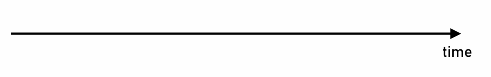
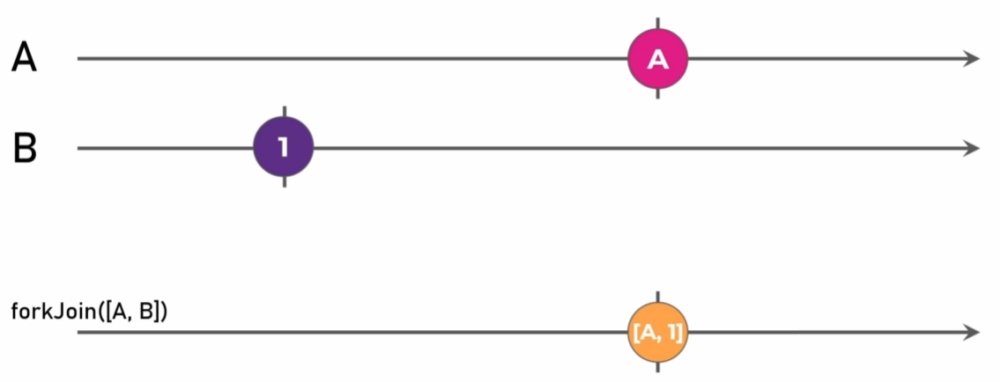
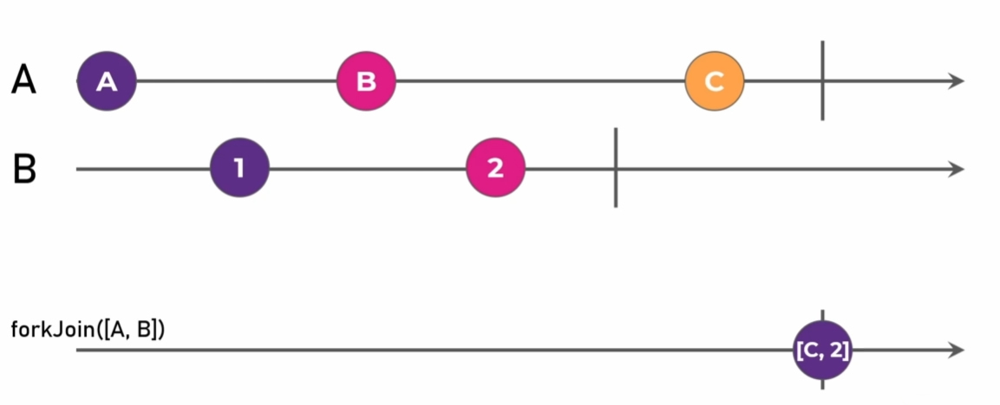
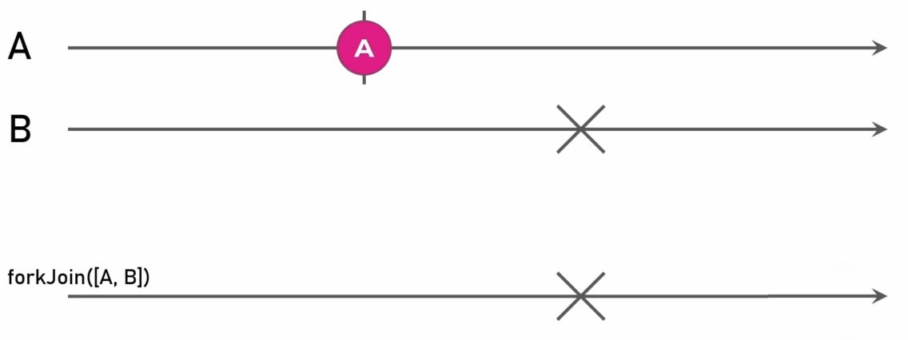
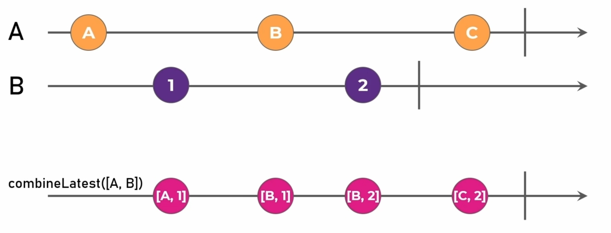
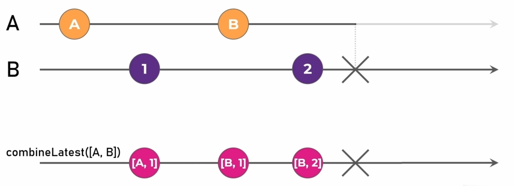

<!-- _backgroundColor: #000 -->
<!-- _class: invert -->

# RxJs y el paradigma reactivo

- Presenta: Eli Jaimes
- Julio 2023

---

<!-- _class: invert -->

# ¿Qué es RxJs?

- Extensiones reactivas para JavaScript.
- Las extensiones reactivas fueron desarrolladas originalmente por Microsoft como **Rx.NET**.
- Está diseñado para trabajar con acciones y eventos _asíncronos_.

---

<!-- _backgroundColor: #2D282E -->
<!-- _color: white -->

### RxJs

Nos permite observar y reaccionar a los datos a medida que
fluyen a través del tiempo.

- **Emitir** elementos
- **Reaccionar** a cada elemento emitido
  - Transformar
  - Filtrar
  - Modificar
- **Combinar**
- **Cache**

---

<!-- _backgroundColor: #2D282E -->
<!-- _color: white -->

### ¿Qué usar en lugar de RxJs?

- **Callback**: es una función que se puede llamar después de una operación asíncrona se haya completado. Pero pueden ser difíciles de gestionar cuando se trabaja con operaciones de asíncronas anidadas.
- **Promise**: es un objeto que puede producir un solo valor en algún momento en el futuro, solo puede manejar una sola emisión y no es cancelable.
- **async/await**: es una sintaxis especial que permite escribir código asíncrono que se ve sincrónico, solo puede manejar una sola emisión y es no cancelable.

---

<!-- _backgroundColor: #2D282E -->
<!-- _color: white -->

### ¿Porqué usar RxJs?

- RxJs proporciona una sola técnica para trabajar con cualquier tipo de datos (eventos del teclado, mouse, datos de arreglos, archivos o una API), podemos trabajar con diferentes fuentes utilizando _las mismas técnicas y operadores_.
- Se puede _componer_ información fácilmente a parti de diversas fuentes.
- RxJs puede _producir múltiples valores_ en el tiempo y utiliza un modelo _push_ para notificar cuando ocurren acciones específicas, lo que facilita reaccionar a las interacciones del usuario o cambios en los datos.
- RxJs es _perezoso_, una evaluación no comienza hasta la suscripción, por lo que podemos crear recetas que solo se ejecutan cuando necesitamos el resultado.
- RxJs tiene _manejo de errores_ incorporado.
- Con RxJs podemos cancelar acciones asíncronas.

---

<!-- _class: invert -->

# ¿Qué es el desarrollo reactivo?

- El paradigma declarativo se encarga de los _flujos de datos_ y la _propagación de los cambios_.
- El código es **reactivo** cuando un _cambio_ en alguna _entrada_ conduce a un _cambio automático_ en la _salida_.

---

<!-- _backgroundColor: #2D282E -->
<!-- _color: white -->

### Ventajas del desarrollo reactivo

- Nuestro código puede fácilmente reaccionar a las acciones del usuario y reaccionar los cambios de estado, por tanto _el código observa cambios y reacciona_, en lugar de llamar imperativamente a métodos.
- El código automáticamente _compone y combina_ conjuntos de datos, para calcular nuevos datos.
- Múltiples componentes pueden observar emisiones de datos. Por lo que una aplicación puede _comunicarse entre componentes_ sin un acoplamiento cercano.
- El manejo de errores puede ser también reactivo, haciendo que la aplicación sea _más resistente a la fallas_.
- Las técnicas reactivas pueden ayudarnos a _administrar los datos y el estado_ de la aplicación.

---

<!-- _backgroundColor: #2D282E -->
<!-- _color: white -->

# Streams

- Los elementos en un **stream** pueden venir en varios puntos de tiempo.

|                                                  |                                               |
| ------------------------------------------------ | --------------------------------------------- |
| Timeline                                         | Mouse events                                  |
|             |  |
| Input events                                     | HTTP request                                  |
|  |   |

---

<!-- _backgroundColor: #2D282E -->
<!-- _color: white -->

# Marble diagrams

- Permiten visualizar valores emitidos a través del tiempo.

|                                                   |                                                      |
| ------------------------------------------------- | ---------------------------------------------------- |
| Next notification                                 | Complete notification                                |
|   |  |
| Error notification                                | Summary                                              |
|  |  |

---

<!-- _backgroundColor: #2D282E -->
<!-- _color: white -->

# Observer

- Un _observer_ es un objeto que observa y responde a notificaciones especificadas como métodos. _next()_ para manejar el siguiente dato emitido, _error()_ para manejar una condición de error y _complete()_ para manejar un procesamiento final o limpieza.
- **Observer**: Una colección de _callbacks_ que saben escuchar los valores entregados por un _observable_.
- **Observer**: es un consumidor de valores entregados por un _observable_.
- En RxJs, un _observer_ es definido como una interfaz con métodos _next()_, _error()_ y _complete()_.

```typescript
const observer: Observer<any> = {
  complete: (): void => console.log("✅ - Done"),
  error: (error: Error): void => console.error("❌ - Something wrong occurred: %O", error),
  next: (value: any): void => console.log("✔️ - Got value %O", value),
};
```

---

<!-- _backgroundColor: #2D282E -->
<!-- _color: white -->

# Subscriber

- Internamente RxJs cada _observer_ es convertido en un _subscriber_
- Un _subscriber_ es básicamente un _observer_ con características adicionales para _de subscribirse_ de un _observable_.

---

<!-- _backgroundColor: #2D282E -->
<!-- _color: white -->
<!-- footer: '' -->

# Observable

- **Observable**: una colección de eventos o valores emitidos tiempo.
- Un _observable_ puede ser síncrono o asíncrono, emitir valores finitos o infinitos.
- Podemos operar los valores emitidos con métodos (map, filter, concat). Dado que los valores se emiten a través del tiempo podemos aplicar operadores basados en el tiempo (delay, timeout).

```typescript
const observable$: Observable<any> = new Observable((subscriber: Subscriber<any>): void => {
  try {
    subscriber.next();
  } catch (error) {
    subscriber.error(error);
  }
});
```

|                                                        |                                                            |
| ------------------------------------------------------ | ---------------------------------------------------------- |
|  |  |

---

<!-- _backgroundColor: #2D282E -->
<!-- _color: white -->

# Subscriber

- Internamente RxJs cada _observer_ es convertido en un _subscriber_.
- Un _subscriber_ es básicamente un _observer_ con características adicionales para _de subscribirse_ de un _observable_.

---

<!-- _backgroundColor: #2D282E -->
<!-- _color: white -->
<!-- footer: '' -->

# Subscription

- En RxJs llamamos al método _subscribe()_ en un _observable_ para comenzar a recibir notificaciones.
- El método _subscribe()_ recibe un _observer_ para saber a dónde enviar las notificaciones.
- Si no nos _subscribimos_ no recibiremos las notificaciones (comportamiento lazy).

```typescript
const subscription: Subscription = observable$.subscribe({
  complete: (): void => console.log("✅ - Done"),
  error: (error: Error): void => console.error("❌ - Something wrong occurred: %O", error),
  next: (value: any): void => console.log("✔️ - Got value %O", value),
});
```

---

<!-- _class: invert -->

# Operadores en RxJs

- Los _operadores_ son las piezas esenciales que permiten componer de manera fácil y declarativa código asíncrono complejo.
- Los _operators_ son funciones.
- Existen dos tipos de operadores *de creación" y *conectables\*.

---

<!-- _backgroundColor: #2D282E -->
<!-- _color: white -->
<!-- footer: '' -->

# Creation operators

- Crear los observables desde 0 no es la mejor manera de utilizarlos.
- **RxJs** cuenta con un amplio conjunto de funciones de creación.
- Una **Creation function (o Creation operator)** es una manera sencilla de crear un observable con un comportamiento popular.

---

<!-- _backgroundColor: #2D282E -->
<!-- _color: white -->
<!-- footer: '' -->

Ejemplos (Creation operators):

- **ajax**: permite crear observables que realizan llamadas HTTP.
- **of**: emite los valores proporcionados como argumentos y se completa.
- **from**: convierte cosas como arreglos, promesas, iterables en un observable.
- **fromEvent**: crea un observable a partir de algún objetivo. Suscribirse y cancelar la suscripción funciona aquí como 'addEventListener' y 'removeEventListener'.
- **interval**: genera un observable que emite notificaciones en intervalos.
- **forkJoin**: Acepta una arreglo de observables como entrada. Después de completarse todos estos observables, emite un conjunto de los últimos valores emitidos por cada uno de ellos. Muy útil si necesita esperar por el resultado de un par de llamadas HTTP.
- **combineLatest**: También acepta múltiples observables como entrada. Cada vez que cualquiera de ellos emite algo nuevo, un conjunto combinado de los últimos valores se emitirá como un arreglo.

---

<!-- _backgroundColor: #2D282E -->
<!-- _color: white -->

### forkJoin

- Acepta una arreglo de observables como entrada. _Después de completarse todos estos observables_, emite un conjunto de los últimos valores emitidos por cada uno de ellos.
- Muy útil si necesita esperar por el resultado de un par de llamadas HTTP.

## 

---

<!-- _backgroundColor: #2D282E -->
<!-- _color: white -->

|                                        |                                        |
| -------------------------------------- | -------------------------------------- |
|  |  |
|  |                                        |

---

<!-- _backgroundColor: #2D282E -->
<!-- _color: white -->

### combineLatest

- También acepta múltiples observables como entrada. Cada vez que cualquiera de ellos emite algo nuevo, un conjunto combinado de los últimos valores se emitirá como un arreglo.


---

<!-- _backgroundColor: #2D282E -->
<!-- _color: white -->





---

<!-- _backgroundColor: #2D282E -->
<!-- _color: white -->
<!-- footer: '' -->

# Pipeable operators

- Son una de las características más poderosas de **RXJS**.
- Nos permiten _transformar_ notificaciones enviadas por un observable de innumerables maneras.
- Nos permite escribir lógica asíncrona compleja con solo unas pocas líneas de código, lo que facilita la lectura y el trabajo.

---

<!-- _backgroundColor: #2D282E -->
<!-- _color: white -->
<!-- footer: '' -->

Ejemplos (Pipeable operators):

- **filter**: Es similar al operador _filter_ en arreglos de JavaScript, la idea general es la misma. Sin embargo, en lugar de filtrar los elementos en el arreglo, el operador _filter_ filtra los valores emitidos y los pasa a través o no.
- **map**: Es la contraparte en el mundo de streams del operador _map_ de los arreglos en JavaScript. Este operador toma el valor emitido y puede transformarlo en algún otro valor. Útil para extraer una propiedad anidada dentro de un objeto más complejo.
- **tap**: Nos permite causar efectos secundarios sin cambiar las notificaciones. Útil para fines de depuración y aprendizaje.Podemos usarlo para registrar los valores emitidos en cualquier etapa de la tubería de operadores si utilizamos múltiples operadores apilados.
- **debounceTime**: Es útil si la fuente observable emite muchos valores y luego se establece. Esto a menudo se utiliza con las entradas que produce del usuario. Un ejemplo puede ser un escenario en el que el usuario escriba algún valor en un campo de entrada y un valor se re calcula consumiendo tiempo considerable y recursos por cada pulsación de las teclas.

---

<!-- _backgroundColor: #2D282E -->
<!-- _color: white -->
<!-- footer: '' -->

Ejemplos (Pipeable operators):

- **catchError**: Cuando la fuente observable presenta una notificación de error, este operador no pasará este error, sino que usará el observable _fallback_ proporcionado como la nueva fuente.

---

<!-- _class: invert -->

## Volvámonos reactivos en Angular con RxJs

Volverse reactivo significa:

- Dejar atrás los _patrones procedurales_.
- _Trabajar con observables directamente_, en lugar de leer datos en un arreglo y después vincular a ese arreglo, utilizaremos y vincularemos observables
- Crear _observable pipelines_ que reaccionen a datos emitidos, mientras que utilizamos los operadores disponibles en RxJs
- _Transformar_, _componer_ y _combinar_ observables para manejar múltiples fuentes de datos
- Definir _action streams_ para fácilmente reaccionar a las acciones del usuario
